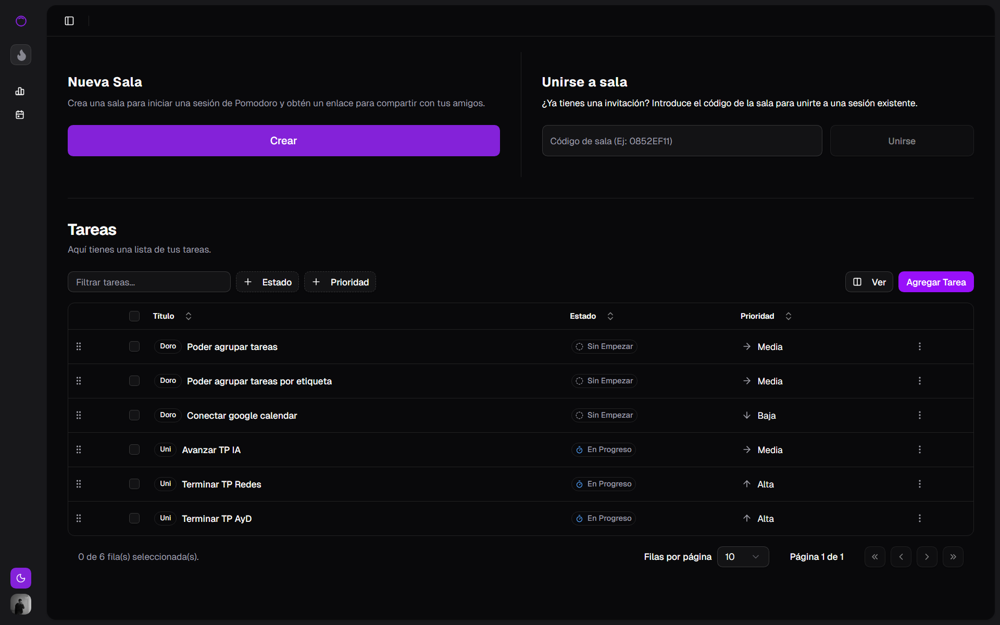
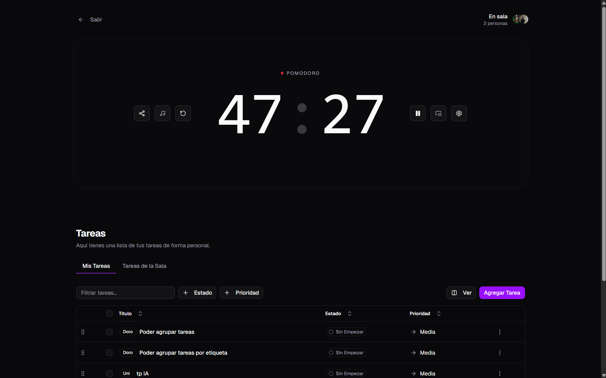
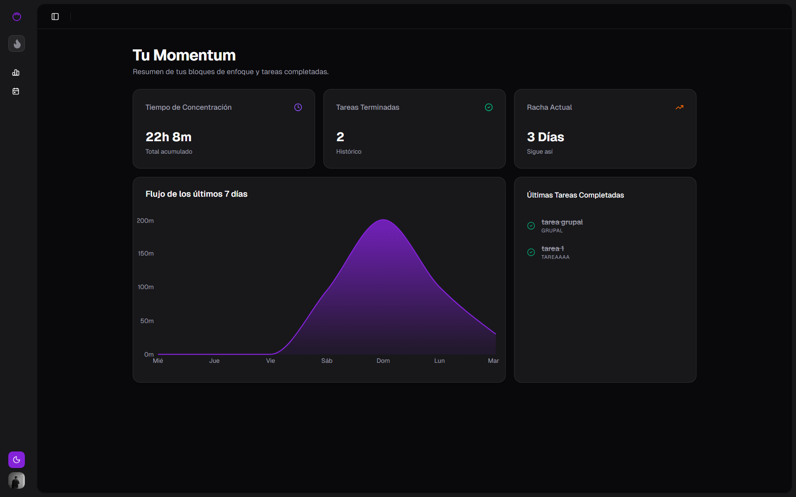
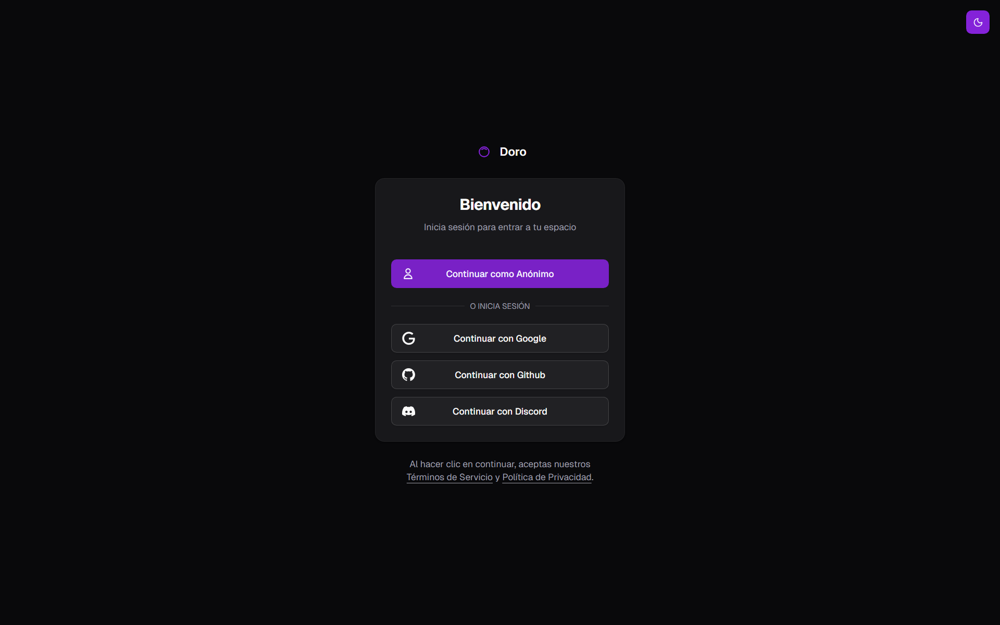

<div align="center">
  
  <h1>Doro</h1>
  <p>Pomodoro colaborativo en tiempo real — estudia con amigos, mantén el ritmo, mide tu progreso.</p>

  <a href="https://doro.page"></a>
  
  
  
</div>

---

## Capturas

| Home | Sala |
|------|------|
|  |  |

| Dashboard | Login |
|-----------|-------|
|  |  |

---

## Funcionalidades

| | |
|---|---|
| ⏱ **Pomodoro y Cronómetro** | Tiempos personalizables para foco, descanso corto y largo |
| 🤝 **Salas en tiempo real** | Crea o únete a salas compartidas — el temporizador se sincroniza para todos |
| 🎵 **Música compartida** | YouTube sincronizado en sala · Spotify individual |
| ✅ **Tareas drag & drop** | Lista compartida con drag & drop, visible para todos en tiempo real |
| 🔥 **Rachas y estadísticas** | Mantené tu racha diaria y revisá tu historial de productividad |
| 🔐 **OAuth** | Google · GitHub · Discord — o acceso rápido anónimo |
| 🌙 **Modo oscuro / claro** | Tema adaptable sin configuración extra |

---

## Extensión de Chrome

Desde el navegador podés abrir una **ventana emergente (popup)** con acceso rápido al temporizador sin salir de tu pestaña activa. Dentro del popup podés:

- Ver el tiempo restante de tu sesión actual
- Cambiar entre **modo Pomodoro** y **Cronómetro** con un clic
- Iniciar, pausar o reiniciar el temporizador

---

## Stack

| Área | Tecnología |
|------|-----------|
| Frontend | React 19 + TypeScript + Vite |
| Estilos | Tailwind CSS v4 · Shadcn UI · Radix UI |
| Animaciones | Framer Motion · dnd-kit |
| Backend | Supabase (PostgreSQL + Auth + Realtime) |
| Estado | Zustand |
| Deploy | Vercel |

---

## Desarrollo local

```bash
git clone https://github.com/leonelcnr/Pomodoro.git
cd Pomodoro
npm install
```

Crea `.env.local` con tus claves de Supabase:

```env
VITE_SUPABASE_URL=tu_url_de_proyecto
VITE_SUPABASE_ANON_KEY=tu_anon_key
```

```bash
npm run dev
```
